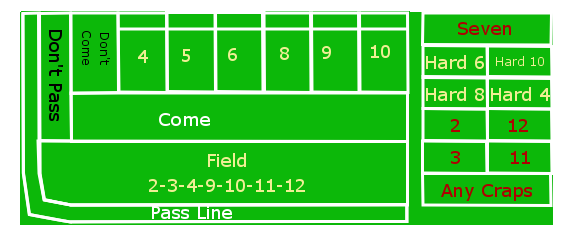

..  _`craps.details`:

Craps Details
=============

In the first section of this chapter, `Craps Game Overview`_,
we will present elements of the game of Craps.
Craps is a stateful game, and we'll describe the state changes in some detail.

We'll look at the way dice work in `Creating A Dice Frequency Distribution`_.

We will review some of the bets available on the Craps table in some
depth in `Available Bets`_. Craps offers some very obscure bets, and part of this obscurity
stems from the opaque names for the various bets. Creating this wide
variety of bets is an interesting programming exercise, and the first
four exercise chapters will focus on this.

In `Some Betting Strategies`_ we will describe some common betting strategies that we will
simulate. The betting strategies described in :ref:`roul` will be
applied to Craps bets, forcing us to examine the Roulette solution for
reuse opportunities.

We'll also look at an alternative set of bets in `Wrong Betting`_.

..  _`craps.details.game.rules`:

Craps Game Overview
--------------------

Craps centers around a pair of six-sided dice. The 36
combinations form eleven numbers from 2 to 12; additionally, if the two
die have equal values, this is called a "hardways," because the
number was made "the hard way".

The table in the casino has a
surface marked with spaces on which players can place bets.
The names of the bets are opaque, and form an obscure jargon. There are
several broad classification of bets, including the following:

-   those which follow the sequence of dice throws that make up a complete game,

-   the propositions based on only the next throw of the dice,

-   some "hardways" bets on rolling an equal pair before the game is revolved, and,

-   some unmarked bets.

These bets will be defined more completely, below, under :ref:`craps.details.bets`.

After the bets are placed, the dice are thrown by one of the players.
This number resolves any one-roll bets into immediate winners or losers; it
also determines the state change in the game, which may also resolve any
game-based bets.

The first roll of the dice in a given game can be an
immediate win or loss, or it can establish the point
for the following rounds of this game. Subsequent rolls either make the
point and win the game, roll a seven and lose the game, or the game
continues. When the game is won, the winning player continues to shoot;
a losing player passes the dice around the table to the next player.

Note that a game is of indefinite length. Less likely point values (4 and 10)
will have longer games. More likely point values (6 and 8) will have
shorter games.

In addition to the bets marked on the table, there are some additional
bets. Some of these are called
odds bets, or free odds bets, and pay off at
odds that depend on the dice, not on the bet itself. An odds bet must be
associated with a bet called a line bet, and are said to be
"behind" the original bet; they can be called "behind the
line" bets. The four line bets will be defined more fully, below.

..  note:: Casino Variation

    There are slight variations in the bets available in different
    casinos. We'll focus on a common subset of bets.

The dice form a frequency distribution with values from 2 to 12. An
interesting preliminary exercise is to produce a table of this
distribution with a small demonstration program. This frequency
distribution is central to understanding the often cryptic rules for
Craps. See :ref:`craps.ov.freq` for a small application to develop this
frequency distribution.

Game State Changes
-------------------

The Craps game has two states: **point off** and
**point on**. When a player begins a game, the point is off;
the initial throw of the dice is called the "come out roll". The
number thrown on the dice determines the next state, and also the bets
that win or lose. The rules are detailed in the following table.

..  rubric:: Craps Game States

..  csv-table:: Point is off. Only **Pass** and **Don't Pass** Bets Allowed.
    :header: "Roll","Bet Resolution","Next State"

    "2, 3, 12","""Craps"": Pass bets lose, Don't Pass bets win.","Point Off"
    "7, 11","""Winner"": Pass bets win, Don't Pass bets lose.","Point Off"
    "4, 5, 6, 8, 9, 10",,"Point on the number rolled, *p*."

..  csv-table:: Point is on *p*. Additional Bets Allowed.
    :header: "Roll","Bet Resolution","Next State"

    "2, 3, 12",,"Point still on *p*"
    11,,"Point still on *p*"
    7,"""Loser"": **all** bets lose. The table is cleared.","Point Off"
    "Point, *p*","""Winner"": point is made, Pass bets win, Don't Pass bets lose.","Point Off"
    "Non-\ *p* number","Come bets are activated on this new number","Point still on *p*"

There is a symmetry to these rules. The most frequent number, 7, is
either an immediate winner or an immediate loser. The next most frequent
numbers are the six point numbers, 4, 5, 6, 8, 9, 10, which form three
sets: 4 and 10 are high odds, 5 and 9 are middle odds, 6 and 8 are low
odds. The relatively rare numbers (2, 3, 11 and 12) are handled
specially on the first roll only, otherwise they are ignored. Because of
the small distinction made between the :emphasis:`craps` numbers (2, 3
and 12), and 11, there is an obscure "C-E" bet to cover both
craps and eleven.

..  _`craps.ov.freq`:

Creating A Dice Frequency Distribution
--------------------------------------

Since Python is interpreted, you can enter the following directly in
the interpreter and get the frequency of each number.

..  rubric:: Dice Frequency I

..  include:: ../../code/dice_frequency.py
    :code: python
    :start-line: 5
    :end-line: 14

We've enumerate all 36 combinations of values :samp:`(d1, d2)`. The sum
of these will be a value between 2 and 12. The list :code:`freq` is a
dictionary that maps an integer sum of the dice to an integer count of the number
of occurrences of that sum.

This can also be done with a counter and a generator expression.

..  rubric:: Dice Frequency II

..  include:: ../../code/dice_frequency.py
    :code: python
    :start-line: 14
    :end-line: 19

Here we've used a :class:`Counter`. We've initialized the counter
using a generator expression that -- similar to the previous example --
enumerates all 36 combinations of values :samp:`(d1, d2)`.

The :class:`Counter` class consumes all of the values from the generator expression.
The generate has two nested ``for`` clauses, ``(d1 + d2 + 2) for d1 in range(6) for d2 in range(6)``
The :class:`Counter` class automatically finds matching values and counts how many times the
duplicate values were seen.

..  _`craps.details.bets`:

Available Bets
--------------

There are four broad classification of bets:

-   those which follow the sequence of dice throws that make up a complete game,

-   those based on just the next throw of the dice (called proposition bets),

-   the hardways bets, and

-   the unmarked bets.

The game bets are also called line bets, can be supplemented with additional odds bets, placed
behind the line bet.  There are actually two sets of game bets based on the pass line and the come line.

The following illustration shows half of a typical craps table
layout. On the left are the game bets. On the right (in the center of
the table) are the single-roll propositions.

    Craps Table Layout

**Game Bets**.
The Game bets have two states.  There is a set of bets allowed for the
first roll, called the "come out" roll.  If a point is established
a number of additional bets become available.  These are the pass line
bets.

In addition to the basic pass line bets, there are also come line
bets, which are similar to game bets.

**Come Out Roll**.
When the point is :emphasis:`off`, the player will be making the come
out roll, and only a subset of bets are available. Once the point is :emphasis:`on`,
all bets are available.

The bets which are allowed on the come out roll are the Pass Line
and Don't Pass Line bets. These bets follow the action of
the player's game. There are several possible outcomes for these two bets.

-   Player throws craps (2, 3, or 12). A Pass Line bet loses. A Don't
    Pass Line bet wins even money on 2 or 3; however, on 12, it returns
    the bet. This last case is called a "push" ; this rule is
    noted on the table by the "bar 12" legend in the Don't Pass area.

-   Player throws 7 or 11. A Pass Line bet wins even money. A Don't Pass
    Line bet loses.

-   Player throws a point number. The point is now :emphasis:`on`. A
    large white token, marked "on" is placed in one of the six
    numbered boxes to announce the point. The player can now place an
    additional odds bet behind the line. Placing a bet behind the Pass
    Line is called "buying odds on the point". Placing a bet
    behind the Don't Pass Line is called "laying odds against the point".

**Point Rolls**.
Once the point is on, there are three possible outcomes.

-   The player makes the point before rolling 7. A Pass Line bet
    wins even money. A Don't Pass Line bet loses. The point
    determines the odds used to pay the behind the Pass Line odds bet.

-   The player throws 7 before making the point. A Pass Line bet
    loses. A Don't Pass Line bet pays even money. The point
    determines the odds used to pay the behind the Don't Pass Line
    odds bet.

-   The player throws a number other than 7 and the point: the game continues.

**Come Line Bets**.
Once the point is on, the bets labeled "Come" and
"Don't Come" are allowed. These bets effectively form a game
parallel to the main game, using a come point instead of the main game
point. Instead of dropping the large "on" token in a numbered
square on the layout, the house will move the individual Come and Don't
Come bets from their starting line into the numbered boxes (4, 5, 6, 8,
9, 10) to show which bets are placed on each point number. There are
several possible outcomes for these two bets.

-   Player throws craps (2, 3, or 12). A Come Line bet loses. There are
    some additional special cases: a Don't
    Come bet wins even money on 2 or 3; it is a push on 12. Established
    come point bets in the numbered squares remain.

-   Player throws 11. A Come Line bet wins even money. A Don't Come bet
    loses. Established come point bets in the numbered squares remain.

-   Player throws a point number (4, 5, 6, 8, 9, or 10). Any come bets
    in that numbered box are winners -- the come point was made -- and
    the point determines the odds used to pay the behind the line odds.
    (Note that if this is the point for the main game, there will be no
    bets in the box, instead the large "on" token will be sitting
    there.) New bets are moved from the Come Line and Don't Come Line to
    the numbered box, indicating that this bet is waiting on that point
    number to be made. Additional behind the line odds bets can now be
    placed. If the main game's point was made, the "on" token
    will be removed (and flipped over to say "off"), and the
    next roll will be a come out roll for the main game. These bets
    (with the exception of the free odds behind a Come Line bet) are
    still working bets.

-   The player throws 7 before making the main point. A Come bet loses.
    A Don't Come bet pays even money. The bets in the numbered boxes are
    all losers.

**Propositions**.
There are also a number of one-roll propositions,
including the individual numbers 2, 3, 7, 11, 12; also field
(2, 3, 4, 9, 10, 11 or 12), any craps (2, 3 or 12), the horn
(2, 3, 11 or 12), and a hop bet. These bets have no
minimum, allowing a player to cover a number of them inexpensively.

**Hardways**.
There are four hardways bets. These are bets that 4, 6, 8 or 10 will
come up on two equal die (the hard way) before they come up on two
unequal die (the easy way) or before a 7 is rolled. Hard 6, for example,
is a bet that the pair (3,3) will be rolled before any of the other four
combinations (1,5), (2,4), (5,1), (4,2) that total 6, or any of the 6
combinations that total 7. These bets can only be placed when the point
is on, but they are neither single-roll propositions, nor are they tied
to the game point.

**Unmarked Bets**.
There are additional unmarked bets. One is to make a "place bet"
on a number; these bets have a different set of odds than the odds bets
behind a line bet. Other unmarked bets are to "buy" a number or "lay"
a number, both of which involve paying a commission on the bet.
Typically, only the six and eight are bought, and they can only be
bought when they are not the point.

For programmers new to casino gambling, see :ref:`Odds and Payouts <craps.bg.odds>` for
more information on odds payments for the various kinds of bets.

..  _`craps.bg.odds`:

..  sidebar:: Odds and Payouts

        Not all of the Craps outcomes are equal probability. Some of the
        bets pay fixed odds, defined as part of the bet. Other bets pay
        odds that depend on the point established.

        The basic Pass Line, Don't Pass, Come Line and Don't Come bets
        are even money bets. A $5 bet wins an additional $5.

        The odds of winning a Pass Line bet is 49.3%. The :math:`1:1` payout
        presumes a 50% chance of winning. The gap between
        actual odds and payout is the house edge.

        The points have distinct odds, as follows:

        - 4 and 10 have odds of :math:`\tfrac{3}{36}` to win, :math:`\tfrac{6}{36}` to lose,
          otherwise the game continues. This is a :math:`1:2` payout.

        - 5 and 9 have odds of :math:`\tfrac{4}{36}` to win, leading to a :math:`4: 6 = 2:3` payout.

        - 6 and 8 have odds of :math:`\tfrac{5}{36}` to win. this is a :math:`5:6` payout.

        Each of these behind-the-line odds bets has a correct payout to
        match the actual odds of winning.

        The combination of a Pass Line bet plus odds behind the line
        narrows the house edge. For example, a bet on the
        Pass Line has an expected return of -1.414%. If we place double
        odds behind the line with an expected return of 0, the net
        expected return for the combination is -0.471%.

        The various proposition bets have odds stated on the table. Note
        that these rarely reflect the actual odds of winning. For
        example, a bet on 12 is a :math:`\tfrac{1}{36}` probability, but only
        pays as if it were :math:`\tfrac{1}{30}`.

        There are :math:`\tfrac{1}{36}` ways to win a hard six or hard eight bet,
        and :math:`\tfrac{10}{36}`. The remaining 25 outcomes are indeterminate.
        While a hard 6 or hard 8 should pay :math:`10:1`, the actual payment is
        :math:`9:1`. Similarly for a hard 4 or hard 10: they should pay :math:`8:1`, the
        actual payment is :math:`7:1`.

..  _`craps.game.ov.workingbets`:

Some Betting Strategies
-----------------------

All of the Roulette betting strategies apply to Craps. However, the
additional complication of Craps is the ability to have multiple working
bets. The player can add bets during the game. The most important of
these additional bets are the behind the line odds bets. Since these are
paid at proper odds, they are the most desirable bets on the layout. The
player, therefore, should place a line bet, followed by a behind the
line odds bet.

The other commonly used additional bets are the Come bets.
These increase the number of working bets. Since the additional
odds bets for these pay proper odds, they are also highly desirable. A
player can place a Come bet, followed by a behind the line odds bet on
the specific number rolled.

Beyond this, the bets are less interesting. All of the proposition
and hardways bets have odds that are incorrect. We can simulate these
bets to discover the house edge built into the incorrect odds.

Some players will count the number of throws in
game, and place a "7" bet if the game lasts more than six throws.
This is a form of betting against oneself. When the player has a Pass Line bet
that the game will be won, they're diluted this with a 7 bet that the game will be
lost. While the common rationale is that the second bet protects against
a loss, it also reduces the potential win. We can simulate this kind of
betting and examine the potential outcomes.

Wrong Betting
---------------

Craps has two forms of odds betting: "right" and "wrong". The Pass
Line and Come Line, as well as buying odds, are all "right".
The Don't Pass, Don't Come and Laying Odds are all "wrong".

Right betting involves odds that provide a large reward for a
small wager. The odds on a Pass Line bet for the number 4 are
:math:`2:1`: the player can win double the bet if the point is made.
The bet is to put 10 at risk to make 20.

Wrong betting involves odds that provide a small reward for a
large wager. The odds on a Don't Pass Line bet for the number 4
are described as "laid at 2:1"; the player will win half of what was bet if the point is missed.
The player puts 20 at risk to make 10.

This distinction can be ignored by novice programmers. None of our
simulated players are wrong bettors, since this involves putting a large
amount at risk for a small payout, which violates a basic rule
of gambling:

    **Never risk a lot to win a little.**

Looking Forward
---------------

Now that we've considered the details of the craps game, we'll
need to look at the overall structure of the solution. It's important
to consider how the classes will interact with each other. Each class,
in isolation, does very little. The aggregation of those classes will
provide the required behavior.

The next chapter will propose an initial set of classes, and some
revisions to classes we've already written.
