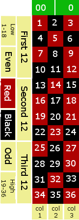

..  _`roul.details`:

Roulette Details
================

We'll start out by looking a the game of Roulette in `Roulette Game`_.
This will focus on Roulette as played in most American casinos.

We will follow this with `Available Bets in Roulette`_. There are a profusion
of bets available in Roulette. Most of the sophisticated betting strategies
focus on just one of the even-money bets.

In `Some Betting Strategies`_, we will describe some common betting strategies that we will
simulate. The betting strategies are interesting and moderately complex
algorithms for changing the amount that is used for each bet in an
attempt to recoup losses.

We'll also include some additional topics in `Roulette Details Questions and Answers`_.

..  _`roul.details.game`:

Roulette Game
-------------

The game of Roulette centers around a wheel with
thirty-eight numbered bins. The numbers include 0, 00
(double zero), and 1 through 36. The table has a surface marked
with spaces on which players can place bets. The spaces
include the 38 numbers, plus a bewildering variety of additional bets,
which will be detailed below.

The "bewildering" is important. Not all of the available bets
are clearly identified on the layout.

After the bets are placed by the players,
the wheel is spun by the house, a small ball is dropped into the
spinning wheel. When the wheel stops spinning, the ball will come to
rest in one of the thirty-eight numbered bins, defining the winning
number. The winning number and all of the related winning bets are paid
off; the losing bets are collected. The payouts vary with the
likelihood of the outcome.

The numbers from 1 to 36 are colored red and black in an arbitrary
pattern. They fit into various ranges, as well as being even or odd,
which defines many of the winning bets related to a given number. The
numbers 0 and 00 are colored green, they fit into none of the ranges,
and are considered to be neither even nor odd. There are relatively few
bets related to the zeroes. The geometry of the betting locations on the
table defines the relationships between clusters of number bets: a group of numbers
is given a colorful name like a street or a corner.

..  note:: American Rules

    There are slight variations in Roulette between American and
    European casinos. We'll focus strictly on the American version.

..  _`roul.details.bets`:

Available Bets in Roulette
---------------------------

There are a variety of bets available on the Roulette table. Each bet
has a payout, which is stated as :math:`n:1` where :math:`n` is
the multiplier that defines the amount won based on the amount bet.

A $5 bet at 2:1 will win $10. After being paid, there will be $15
sitting on the table, the original $5 bet, plus the $10 additional winnings.

..  note:: Odds

    Not all games state their odds using this convention. Some games
    state the odds as "2 :emphasis:`for` 1". This means that the
    total left on the table after the bets are paid will be two times
    the original bet. So a $5 bet will win $5, there will be $10 sitting
    on the table.

    Yes. This is designed to confuse the players.

Here's an image of a common layout of the betting area on a Roulette table.

    Roulette Table Layout

The table is divided into two classes of bets. The "inside" bets
are the 38 numbers and small groups of numbers; these bets all have
relatively high odds. The "outside" bets are large groups of
numbers, and have relatively low odds.

Here's a list of all of the available bets:

-   A "straight bet" is a bet on a single number. There are 38
    possible bets, and they pay odds of 35 to 1. Each bin on the wheel
    pays one of the straight bets.

-   A "split bet" is a bet on an adjacent pair of numbers. For example, 5 is adjacent to 8.
    The bet pays 17:1. The table layout has the numbers arranged sequentially in
    three columns and twelve rows. Adjacent numbers are in the same row
    or column.
    Each bin on the wheel pays from two to four of the available split
    bets. A bet placed on the line between 5 and 8 will be a winner
    if the ball lands in either the 5 bin or the 8 bin.

-   A "street bet" includes the three numbers in a single row,
    which pays 11:1. There are twelve of these bets on the table.
    The chips are placed at the end of the street. There's no marking
    on the table.
    When any one of the three bins wins, the street bet is also a winner.

-   A square of four numbers is called a "corner bet" and pays
    8:1. There are 22 of these bets available. The chips are placed
    at the intersection, overlapping the four numbers.

-   At one end of the layout, it is possible to place a bet on the Five
    numbers 0, 00, 1, 2 and 3. This bet pays 6:1. It is the only combination
    bet that includes 0 or 00. The chips are placed on the intersection
    of the zeroes and the 2.

-   A "line bet" is a six number block, which pays 5:1. It is
    essentially two adjacent street bets. There are 11 such combinations.
    The chips are placed to overlap two adjacent street bets.

The other bets are called "outside" bets. Each of these involves
a group of twelve to eighteen related numbers. None of these outside
bets includes 0 or 00. The only way to bet on 0 or 00 is to place a
straight bet on the number itself, or use the five-number combination bet.

Here's the list of outside bets:

-   Any of the three 12-number ranges (1-12, 13-24, 25-36) pays 2:1.
    There are just three of these bets.

-   Any of the three 12-number columns at 2:1 odds. All of
    the numbers in a given column have the same remainder when divided
    by three. Column 1 contains 1, 4, 7, etc., all of which have a
    remainder of 1 when divided by 3.

-   There are two 18-number ranges: 1-18 is called "low",
    19-36 is called "high". These are called even money bets
    because they pay at 1:1 odds.

-   The individual numbers are colored red or black in an arbitrary
    pattern. Note that 0 and 00 are colored green. The bets on red or
    black are even money bets, which pay at 1:1 odds.

-   The numbers (other than 0 and 00) are also either even or odd. These
    bets are also even money bets.

..  sidebar:: Odds and Payouts

        ..  _roul.bg.odds:

        Not all of the Roulette outcomes are equal probability. Let's
        compare a split bet on 1-2 and an even money
        bet on red. Here are the two bets:

        -   The split bet wins if either 1 or 2 comes up on the wheel.
            This is 2 of the 38 outcomes, or a :math:`\tfrac{1}{19}` probability, 5.26%.

        -   The red bet wins if any of the 18 red numbers come up on the
            wheel. The is 18 of the 38 outcomes, or a :math:`\tfrac{9}{19}` probability, 47.4%.

        Clearly, the red bet is going to win almost ten times more often
        than the 1-2 bet. As an inducement to place bets on rare
        occurrences, the house offers a higher payout on those bets.
        Since the 1-2 split bet wins is so rarely, they will pay 17
        times tge bet. On the other hand, since the red bet wins so
        frequently, they will only pay back the amount of the bet.

        You'll notice that the odds of winning the 1-2 split bet is 1
        chance in 19, but they pay 17 times the bet. Since the bet
        is still sitting on the table, it looks like 18 times the amount.
        It still isn't 19 times the original bet. This discrepancy between the
        actual probability and the payout odds is sometimes called the
        :emphasis:`house edge`.

        The edge varies widely among the various bets
        in the game of Roulette. For example, the 5-way bet has :math:`\tfrac{5}{38}`
        ways of winning, but pays only 6:1. There is only a 13.2% chance
        of winning, but they pay as if the outcome had a 16.7% chance,
        keeping the 3.5% difference.

        Similarly, there's a 5.26% chance to win a
        split bet, but the house pays as if it were a 5.88% chance, a
        .62% discrepancy in the odds.

        The smallest discrepancy between actual chances of winning
        (47.4%) and the payout odds (50%) is available on the even money
        bets: red, black, even, odd, high or low. All the betting
        systems that we will look at focus on these bets alone, since
        the house edge is the smallest.

..  _`roul.details.betting`:

Some Betting Strategies
-----------------------

Perhaps because Roulette is a relatively simple game, elaborate betting
systems have evolved around it. Searches on the Internet turn up a many
copies of the same basic descriptions for a number of betting systems.
Our purpose is not to uncover the actual history of these systems, but
to exploit them for simple OO design exercises. Feel free to
research additional betting systems or invent your own.

**Martingale**.
The Martingale system starts with a base wagering amount, :emphasis:`w`,
and a count of the number of losses, :emphasis:`c`, initially 0. Each
loss doubles the bet.

Any given spin will place an amount of :math:`w \times 2^{c}`
on a 1:1 proposition (for example, red).
When a bet wins, the loss count is reset to zero; resetting the bet to
the base amount, :emphasis:`w`. This assures that a single win will
recoup all losses.

Note that the casinos effectively prevent successful use of this system
by imposing a table limit. At a $10 Roulette table, the limit may be as
low as $1,000. A Martingale bettor who lost six times in a row would be
facing a $640 bet, and after the seventh loss, their next bet would
exceed the table limit. At that point, the player is unable to recoup
all of their losses. Seven losses in a row is only a 1 in 128
probability; making this a relatively likely situation.

**Waiting**.
Another system is to wait until some number of losses have elapsed. For
example, wait until the wheel has spun seven reds in a row, and then bet
on black. This can be combined with the Martingale system to double the
bet on each loss as well as waiting for seven reds before betting on black.

This "wait for a favorable state" strategy is based on a confusion between the outcome of each
individual spin and the overall odds of given collections of spins.
If the wheel has spun seven reds in a row, it's "due" to spin black.

**1-3-2-6 System**.
Another betting system is called the 1-3-2-6 system. The
idea is to avoid the doubling of the bet at each loss and running into
the table limit. Rather than attempt to recoup all losses in a single
win, this system looks to recoup all losses by waiting for four wins in
a row.

The sequence of numbers (1, 3, 2 and 6) are the multipliers to
use when placing bets after winning. At each loss, the sequence resets
to the multiplier of 1. At each win, the multiplier is advanced through
the sequence. After one win, the bet is now :math:`3w`. After a
second win, the bet is reduced to :math:`2w`, and the winnings of :math:`4w`
are "taken down" or removed from play. In the event
of a third win, the bet is advanced to :math:`6w`. Should there be
a fourth win, the player has doubled their money, and the sequence resets.

**Cancellation**.
Another method for tracking the lost bets is called the Cancellation
system or the :emphasis:`Labouchere` system. The player starts with a
betting budget allocated as a series of numbers. The usual example is
1, 2, 3, 4, 5, 6, 7, 8, 9.

Each bet is sum of the first and last numbers in the last. In this
case 1+9 is 10. At a win, cancel the two numbers used to make the
bet. In the event of all the numbers being cancelled, reset the
sequence of numbers and start again. For each loss, however, add the
amount of the bet to the end of the sequence as a loss to be recouped.

Here's an example of the cancellation system using
1, 2, 3, 4, 5, 6, 7, 8, 9.

#.  Bet 1+9. A win. Cancel 1 and 9, leaving
    2, 3, 4, 5, 6, 7, 8.

#.  Bet 2+8. A loss. Add 10, leaving
    2, 3, 4, 5, 6, 7, 8, 10.

#.  Bet 2+10. A loss. Add 12, leaving
    2, 3, 4, 5, 6, 7, 8, 10, 12.

#.  Bet 2+12. A win. Cancel 2 and 12, leaving
    3, 4, 5, 6, 7, 8, 10.

#.  Next bet will be 3+10.

**Fibonacci**.
A player could use the Fibonacci Sequence to structure a
series of bets in a kind of cancellation system. The Fibonacci Sequence is
1, 1, 2, 3, 5, 8, 13, ...

At each loss, the sum of the previous two bets -- the next numbers
in the sequence -- becomes the new bet amount. In the event of a
win, we simply revert to the base betting amount. This allows
the player to easily track their accumulated losses, with bets that
could recoup those losses through a series of wins.

Roulette Details Questions and Answers
---------------------------------------

Do the house limits really have an impact on play?

    The snarky answer is "Of course they do, or the house wouldn't impose them."

    Many betting strategies increase bets on a loss,
    in an effort to break even or get slightly ahead. How many losses can occur
    in a row?

    The answer is "indefinite." The odds of a long series of losses
    get less and less probable, but it never becomes zero.

    For a simple :math:`P = .5` event -- like flipping a coin -- we can
    often see three heads in a row. One head is :math:`P(\text{h}) = .5`.
    Two heads is :math:`P(\text{h},\text{h}) = .5 \times .5 = 0.25`. If we partition a sequence of
    coin tosses into pairs, we expect that 1 of 4 pairs will have two heads.

    Three heads is :math:`P(\text{h},\text{h},\text{h}) = .5 \times .5 \times .5 = 0.125`.
    If we partition a sequence of coin tosses into threes, we expect that 1 of 8 triples
    will have three heads.

    A table limit that's 30 times the base bet, say $300 at a $10 table,
    is a way of capping play at an event has a :math:`P = \dfrac{1}{30} = 0.033`.
    Three percent is the odds of seeing five heads in a row.  If we double the bet
    on each loss, we'd only need to see five losses in a row to reach the table
    limit.

    This three percent limit is in line with our ways the house maintains an edge
    in each game.

Why are there so many bets in Roulette?

    This is a universal feature of gambling. A lot of different kinds of bets
    allows a player to imagine that one of those bets is better than the others.

    Many of the betting strategies leverage the simplest of bets: a nearly
    even-money proposition like red, black, even, odd, high, or low. These
    are easy to analyze because they're (nearly) :math:`P = .5` and the
    cost of a series of losses or a series of wins is easy to compute.

    When we look at Craps, the core bet -- the "pass line" -- is also nearly
    :math:`P = .5`, allowing the use of similar betting strategies.

    The idea of the various betting strategies, then, is to avoid all
    of the complexity and focus on a simple bet. For the most part,
    our :class:`Player` implementations can follow this approach.

    However, if we implement the complete game, we can write :class:`Player`
    that make a number of different kinds of bets to see how the house
    edge breaks the various betting strategies.

Looking Forward
---------------

Now that we've considered the details of the roulette game, we'll
need to look at the overall structure of the solution. It's important
to consider how the classes will interact with each other. Each class,
in isolation, does very little. The aggregation of those classes will
provide the required behavior.

The next chapter will propose an initial set of classes for the game.
